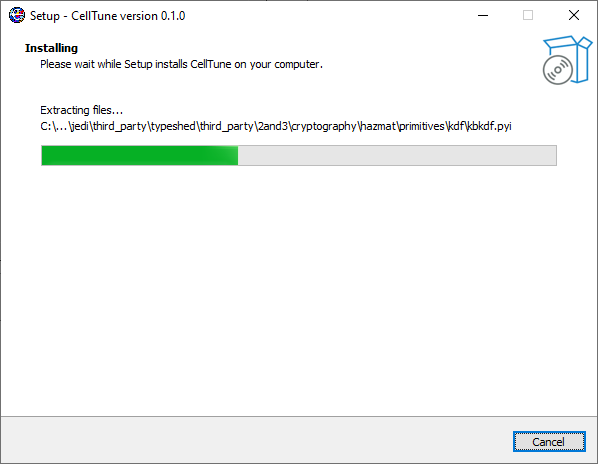
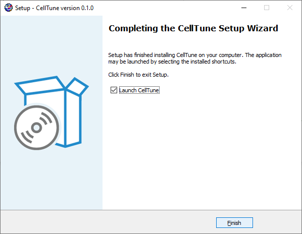

## Download CellTune
&nbsp;  
Get the latest version of CellTune for your platform:

- [Download for macOS (Apple Silicon)](https://github.com/KerenLab/CellTune-App/releases/download/v0.1.0/CellTune-v0.1.0-macOS-arm64.dmg)
- [Download for macOS (Intel)](https://github.com/KerenLab/CellTune-App/releases/download/v0.1.0/CellTune-v0.1.0-macOS-intel.dmg)
- [Download for Windows](https://github.com/KerenLab/CellTune-App/releases/download/v0.1.0/CellTune-v0.1.0-Windows-setup.exe)
- Download for Linux — *coming soon*

---

## System Requirements
&nbsp;
**Operating Systems:**
- macOS 12 or later (Apple Silicon or Intel)
- Windows 10/11 (64-bit)

**Tested on:**
- macOS 12.6 (Intel), macOS 13.0 (M1), macOS 15.3 (M2)
- Windows 10 Enterprise (21H2), Windows Server 2019 Standard (1809)

**Dependencies:**
- All required dependencies are bundled inside the application. No additional installation is needed.

**Hardware:**
- No special hardware required.
- ≥32 GB RAM and ≥8 CPU cores are highly recommended for efficient processing.
- A dedicated GPU (Apple Silicon or CUDA-capable) is highly recommended for improved performance, most especially for CNN-based features (e.g. marker positivity inference).

---

## Installation
&nbsp;  
> Estimated installation time: 1-3 minutes  

### macOS
1. Download the `.dmg` file appropriate for your system (Apple Silicon or Intel).
2. Open the `.dmg` file.
3. Drag the CellTune icon into the **Applications** folder.  
   
4. If you receive a warning about an unverified developer:
   - Right-click (or Ctrl+Click) on the CellTune app icon and select **Open**.
   - Then click **Open** again when prompted.
   - You should only need to do this once.

> _[This warning will be removed after code signing/notarization.]_

---

### Windows
1. Download and run the `.exe` setup file.
2. If you see a **“Windows protected your PC”** message, click **More info**, then **Run anyway**.
3. Follow the setup wizard through the installation steps.  
     
     
     
   

---

## First Launch
&nbsp;
After installation, CellTune should open to a startup screen.  
You can start a new project following the [Documentation](documentation) or load the [demo data](#demo-data) and follow the full [Tutorial](tutorial).

---

## Demo Data
&nbsp;
[Download images and tables for the tutorial](https://github.com/KerenLab/CellTune-App/releases/download/v0.1.0/CellTune_Demo_Data.zip)

---
© {{ site.time | date: '%Y' }} Weizmann Institute of Science. All rights reserved. [License](/license/)
