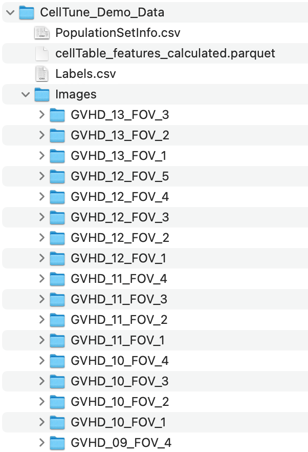
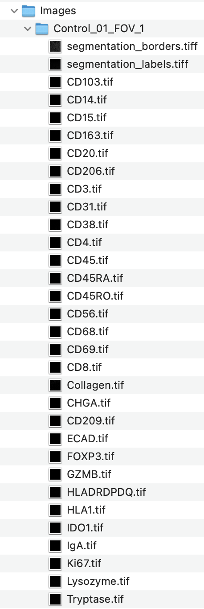

## Tutorials
&nbsp;  

If you haven’t already installed the CellTune software, please start with the [Download & Install page](download) before continuing.

---
### Step 1: Download Demo Data
&nbsp;  
[Download images and tables for the tutorial](https://github.com/KerenLab/CellTune-App/releases/download/v0.2.2/CellTune_Demo_Data.zip)

After downloading, unzip the folder.  
You can extract it to your **Downloads** folder or create a dedicated folder such as `CellTune_Data` in your **Documents**.

---

### Demo Data Contents

The demo dataset included with CellTune provides a complete example of spatial proteomics analysis using multiplexed tissue images from **control** and **GVHD** intestinal biopsies, as described in [Azulay et al., bioRxiv 2025](https://www.biorxiv.org/content/10.1101/2024.09.02.610085v1.full).

### `CellTune_Demo_Data/`

- `cellTable_features_calculated.parquet`  
  Pre-computed single-cell features, including intensity, morphology, and spatial statistics.

- `Labels.csv`  
  Cell-level annotations for training and evaluation.

- `PopulationSetInfo.csv`  
  Metadata describing the populations (cell types).

- `Images/`  
  Contains all image data and segmentations used in the tutorial.

### `Images/`

This folder contains **75 subfolders**, each corresponding to a single field of view (FOV) from either control or GVHD tissue:

- `Control_01_FOV_1`, `Control_01_FOV_2`, ..., `GVHD_03_FOV_2`, etc.

&nbsp;  

Each Image (FOV) folder includes:

- **Protein (Marker) Channels**  
  Single-channel grayscale `.tif` images (e.g., `CD3.tif`, `CD4.tif`, `CD8.tif`, `FOXP3.tif`, etc.) representing individual protein markers.

- **Additional Feature Channels**  
  Folders may also include:
  - Subregion masks (e.g., epithelium, muscle, vasculature)
  - Composite or colocalization images (combining multiple marker channels) used for feature extraction 

- **Segmentation Files**  
  - `segmentation_labels.tiff`: Cell instance segmentation image.  
    Each pixel is labeled with a **unique cell ID**, with background as `0`.
  - `segmentation_borders.tiff`: Outlines of segmented cell borders (purely for visualization).

Each FOV in this dataset has 73 channel files + 2 segmentation files.

&nbsp;  
...  

These files will be loaded directly into CellTune when starting a new project.

---

### Step 2: New Project Setup
&nbsp;  

Create a new project using the demo data:

<video width="100%" controls>
  <source src="/assets/tutorial/NewProjectSetup.mp4" type="video/mp4">
  Your browser does not support the video tag.
</video>

---

### Step 3: Main Window

### 3A. Select and Adjust Channels
&nbsp;  

Select channels and adjust channel brightness:

<video width="100%" controls>
  <source src="/assets/tutorial/AdjustChannels.mp4" type="video/mp4">
  Your browser does not support the video tag.
</video>

---

### 3B. Create Channel Groups
&nbsp;  

Create channel groups:
(You can select and change groups of channels with a single click!)

<video width="100%" controls>
  <source src="/assets/tutorial/ChannelGroups.mp4" type="video/mp4">
  Your browser does not support the video tag.
</video>

Type the channel group name in the box, then press the (+) button.
To delete a channel group press the (-) button. 
If you change the channels with an existing channel group name selected, the (+) button will update the channel group.
> Tip: You can scroll through channel groups with the up and down arrows.

---

### 3C. Change Image 
&nbsp;  

The top left panel allows you to select different images from your project.

<video width="100%" controls>
  <source src="/assets/tutorial/ChangeImage.mp4" type="video/mp4">
  Your browser does not support the video tag.
</video>

> Tip: When an image is selected, you can scroll through images with the up and down arrows.

---

### 3D. Adjust Segmentation 
&nbsp;  

Adjust segmentation opacity and hover fill through segment controls.

<video width="100%" controls>
  <source src="/assets/tutorial/AdjustSegmentation.mp4" type="video/mp4">
  Your browser does not support the video tag.
</video>

> Tip: 0.4 is our favorite opacity setting for the segmentation.

---

### Step 4: Features

### 4A. Compute Features
&nbsp;  

Features must be computed or imported in order to enable gating, classification, & hover info.

<video width="100%" controls>
  <source src="/assets/tutorial/CalculateFeatures.mp4" type="video/mp4">
  Your browser does not support the video tag.
</video>

---

### 4B. Import Features
&nbsp;  

Features can be imported via a cellTable (CSV or parquet file)
The cellTable should have the columns: (image, cellID)

<video width="100%" controls>
  <source src="/assets/tutorial/ImportFeatures.mp4" type="video/mp4">
  Your browser does not support the video tag.
</video>

---

### 4C. Hover Legend Features
&nbsp;  

Select features that will be displayed while hovering

<video width="100%" controls>
  <source src="/assets/tutorial/HoverLegend.mp4" type="video/mp4">
  Your browser does not support the video tag.
</video>

---

### Step 5: Create Empty Population Set
&nbsp;  

Create an empty population set. You can add populations to it (e.g. from gating)

<video width="100%" controls>
  <source src="/assets/tutorial/CreateEmptyPopulationSet.mp4" type="video/mp4">
  Your browser does not support the video tag.
</video>

---

### Step 6: Gating

### 6A. Gating Basics
&nbsp;  

Select the feature that you want to gate and click "Apply Gate".
Shown is an example of gating CD3+ and CD4+ cells.

<video width="100%" controls>
  <source src="/assets/tutorial/GatingCD3CD4.mp4" type="video/mp4">
  Your browser does not support the video tag.
</video>

Gating occurs across the entire project currently. (We are adding the capability to limit to the current image).

---

### 6B. Adjust Gating Appearance
&nbsp;  

You can adjust the opacity and whether gated cells are filled in.

<video width="100%" controls>
  <source src="/assets/tutorial/AdjustGatingOpacity.mp4" type="video/mp4">
  Your browser does not support the video tag.
</video>

Currently gated cells can only be displayed in the color cyan. (We are adding the capability to edit this).

---

### 6C. Create Population from Gating
&nbsp;  

<video width="100%" controls>
  <source src="/assets/tutorial/GatingCreatePopulation.mp4" type="video/mp4">
  Your browser does not support the video tag.
</video>

---

### 6D. Filter Gate by Population
&nbsp;  

You can select populations in the current population set and use them as a filter for your gating.

<video width="100%" controls>
  <source src="/assets/tutorial/GatingPopulationFilter.mp4" type="video/mp4">
  Your browser does not support the video tag.
</video>

---

### 6E. Edit Gating Expression
&nbsp;  

You can edit your gating expression to use AND (&), OR (|), and NOT (!) operations.

<video width="100%" controls>
  <source src="/assets/tutorial/GatingEditExpression.mp4" type="video/mp4">
  Your browser does not support the video tag.
</video>

By default the gating expression uses AND (&) for all compound gates.

---

### Step 7: Import Population Set
&nbsp;  

Population sets can be imported from files (CSV). Columns should be (image, cellID, class).
Here we are importing labels to be used for training a classifier later. We can also import Population set info which includes colors, channels, and definitions for cell types (useful later).

<video width="100%" controls>
  <source src="/assets/tutorial/ImportPopulationSet&Info.mp4" type="video/mp4">
  Your browser does not support the video tag.
</video>

A cell can belong to multiple populations. For population sets that are used as labels for training classifiers we encourage limiting a cell to one population.

---

### Step 8: Classification

### 8A. Create Classifier
&nbsp;  

Create a classifier and select the features it will use for training.
The features were computed or imported previously in step 4.

<video width="100%" controls>
  <source src="/assets/tutorial/CreateClassifier.mp4" type="video/mp4">
  Your browser does not support the video tag.
</video>

---

### 8B. Add Labels to Classifier
&nbsp;  

Add training labels to a classifier. You can select an existing population set.
This action will create a new population set called "Labels_{Classifier_Name}"

<video width="100%" controls>
  <source src="/assets/tutorial/ClassifierAddLabels.mp4" type="video/mp4">
  Your browser does not support the video tag.
</video>

---

### 8C. Train Classifier
&nbsp;  

Trains the CellTune classifier using the features and labels. Please be patient.

<video width="100%" controls>
  <source src="/assets/tutorial/ClassifierTraining.mp4" type="video/mp4">
  Your browser does not support the video tag.
</video>

CellTune trains two models XGBoost and CatBoost by default. CatBoost is slow without GPU (1-2 hours), so LightGBM may be substituted if desired.

---

### 8D. Plot Confusions
&nbsp;  

Plot a confusion matrix showing the agreements and disagreements between the two models trained. 

<video width="100%" controls>
  <source src="/assets/tutorial/PlotConfusions.mp4" type="video/mp4">
  Your browser does not support the video tag.
</video>

---

### Step 9: Visualize Populations
&nbsp;  

You can select a population set and color the cells by the populations.
Here we select the predictions from the classifier and visualize the predictions.

<video width="100%" controls>
  <source src="/assets/tutorial/VisualizePredictions.mp4" type="video/mp4">
  Your browser does not support the video tag.
</video>

You can put one population on and make it transparent to compare it to the protein expression as shown:

<video width="100%" controls>
  <source src="/assets/tutorial/VisualizePopulationsOpacity.mp4" type="video/mp4">
  Your browser does not support the video tag.
</video>

---

### Step 9: Sampling and Labeling

### 9A. Cell Sampling
&nbsp;  

You can adjust the default settings for sampling.

<video width="100%" controls>
  <source src="/assets/tutorial/ClassifierSample.mp4" type="video/mp4">
  Your browser does not support the video tag.
</video>

!**Note** if you get an error while loading review, then you need to import PopulationSetInfo for Pred_ALL_Classifier_1. This will be corrected in the upcoming version 0.1.1.

---

### 9B. Labeling
&nbsp;  

<video width="100%" controls>
  <source src="/assets/tutorial/Labeling1.mp4" type="video/mp4">
  Your browser does not support the video tag.
</video>

---

### 9C. Add New Population
&nbsp;  

<video width="100%" controls>
  <source src="/assets/tutorial/ReviewAddNewPopulation.mp4" type="video/mp4">
  Your browser does not support the video tag.
</video>

---

### 9D. Exit Review and Retrain Classifier
&nbsp;  

<video width="100%" controls>
  <source src="/assets/tutorial/ExitReviewRetrain.mp4" type="video/mp4">
  Your browser does not support the video tag.
</video>

---

### 9E. Export Populations
&nbsp;  

<video width="100%" controls>
  <source src="/assets/tutorial/ExportPopulationsCSV.mp4" type="video/mp4">
  Your browser does not support the video tag.
</video>

---

© {{ site.time | date: '%Y' }} Weizmann Institute of Science. All rights reserved. [License](/license/)
