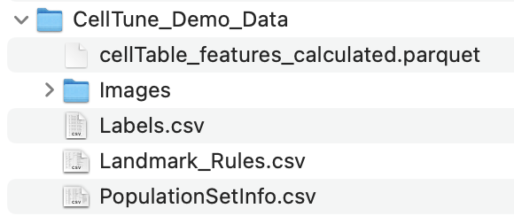
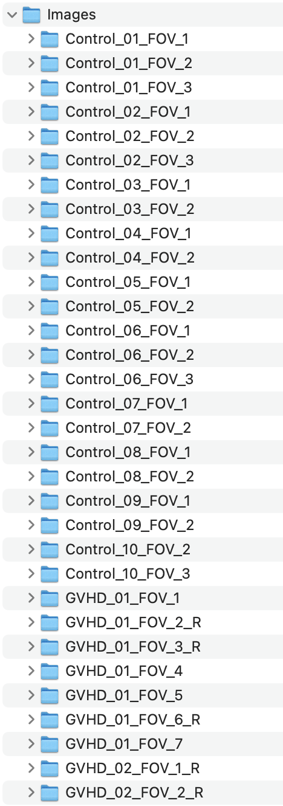

## Tutorials
&nbsp;  

If you haven’t already installed the CellTune software, please start with the [Download & Install page](download) before continuing.

---
### Step 1: Download Demo Data
&nbsp;  
[Download images and tables for the tutorial](https://github.com/KerenLab/CellTune-App/releases/download/v0.1.0/CellTune_Demo_Data.zip)

After downloading, unzip the folder.  
You can extract it to your **Downloads** folder or create a dedicated folder such as `CellTune_Data` in your **Documents**.

---

### Demo Data Contents

The demo dataset included with CellTune provides a complete example of spatial proteomics analysis using multiplexed tissue images from **control** and **GVHD** intestinal biopsies, as described in [Azulay et al., bioRxiv 2025](https://www.biorxiv.org/content/10.1101/2024.09.02.610085v1.full).

### `CellTune_Demo_Data/`

- `cellTable_features_calculated.parquet`  
  Pre-computed single-cell features, including intensity, morphology, and spatial statistics.

- `Labels.csv`  
  Cell-level annotations for training and evaluation.

- `Landmark_Rules.csv`  
  Gating rules used to define landmark populations.

- `PopulationSetInfo.csv`  
  Metadata describing the available population sets.

- `Images/`  
  Contains all image data and segmentations used in the tutorial.

### `Images/`

This folder contains **75 subfolders**, each corresponding to a single field of view (FOV) from either control or GVHD tissue:

- `Control_01_FOV_1`, `Control_01_FOV_2`, ..., `GVHD_03_FOV_2`, etc.

&nbsp;  
...  

Each Image (FOV) folder includes:

- **Protein (Marker) Channels**  
  Single-channel grayscale `.tif` images (e.g., `CD3.tif`, `CD4.tif`, `CD8.tif`, `FOXP3.tif`, etc.) representing individual protein markers.

- **Additional Feature Channels**  
  Folders may also include:
  - Subregion masks (e.g., epithelium, muscle, vasculature)
  - Composite or colocalization images (combining multiple marker channels) used for feature extraction 

- **Segmentation Files**  
  - `segmentation_labels.tiff`: Cell instance segmentation image.  
    Each pixel is labeled with a **unique cell ID**, with background as `0`.
  - `segmentation_borders.tiff`: Outlines of segmented cell borders (purely for visualization).

Each FOV in this dataset has 73 channel files + 2 segmentation files.

&nbsp;  
...  

These files will be loaded directly into CellTune when starting a new project.

---

### Step 2: New Project Setup
&nbsp;  

Create a new project using the demo data:

<video width="100%" controls>
  <source src="/assets/tutorial/NewProjectSetup.mp4" type="video/mp4">
  Your browser does not support the video tag.
</video>

---

### Step 3: Main Window

#### 3A. Select and Adjust Channels
&nbsp;  

Select channels and adjust channel brightness:

<video width="100%" controls>
  <source src="/assets/tutorial/AdjustChannels.mp4" type="video/mp4">
  Your browser does not support the video tag.
</video>

#### 3B. Create Channel Groups
&nbsp;  

Create channel groups:
(You can select and change groups of channels with a single click!)

<video width="100%" controls>
  <source src="/assets/tutorial/ChannelGroups.mp4" type="video/mp4">
  Your browser does not support the video tag.
</video>

Type the channel group name in the box, then press the (+) button.
To delete a channel group press the (-) button. 
If you change the channels with an existing channel group name selected, the (+) button will update the channel group.
> Tip: You can scroll through channel groups with the up and down arrows.

#### 3C. Change Image 
&nbsp;  

The top left panel allows you to select different images from your project.

<video width="100%" controls>
  <source src="/assets/tutorial/ChangeImage.mp4" type="video/mp4">
  Your browser does not support the video tag.
</video>

> Tip: When an image is selected, you can scroll through images with the up and down arrows.

#### 3D. Adjust Segmentation 
&nbsp;  

Adjust segmentation opacity and hover fill through segment controls.

<video width="100%" controls>
  <source src="/assets/tutorial/AdjustSegmentation.mp4" type="video/mp4">
  Your browser does not support the video tag.
</video>

> Tip: 0.4 is our favorite opacity setting for the segmentation.

---

© {{ site.time | date: '%Y' }} Weizmann Institute of Science. All rights reserved. [License](/license/)
